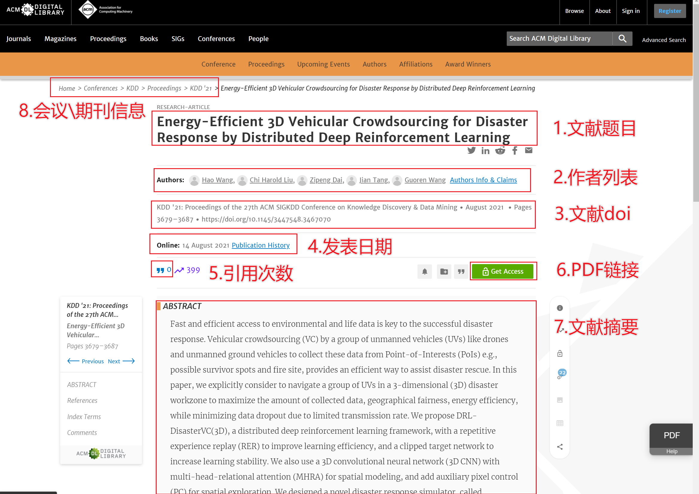

# Let's Go For NeurIPS

- [Let's Go For NeurIPS](#head1)
    - [ 项目介绍](#head2)
    - [ 小组分工](#head3)
    - [ 功能特色](#head4)
        - [ 1、爬取数据自动去重](#head5)
        - [ 2、IP池爬取](#head6)
        - [ 3、线程池爬取](#head7)
        - [ 4、增量爬取](#head8)
        - [ 5、断点续爬](#head9)
        - [ 6、日志技术](#head10)
    - [ 整体效果](#head11)
    - [ 执行方法](#head12)
        - [ 1、运行环境](#head13)
        - [ 2、安装依赖](#head14)
        - [ 3、运行](#head15)
    - [ 第三方库依赖](#head16)
    - [ 系统架构](#head17)
        - [ 1、总体架构](#head18)
        - [ 2、爬虫服务](#head19)
    - [ 各模块执行原理](#head20)
        - [ 1、ACM](#head21)
        - [ 2、Springer](#head22)
        - [ 3、ScienceDirect](#head23)
        - [ 4、IP池服务](#head24)
        - [ 5、数据库](#head25)
    - [ 代码及文件结构](#head26)
# <span id="head1"> Let's Go For NeurIPS</span>

## <span id="head2"> 项目介绍</span>

我们的工作基于[scrapy](https://scrapy.org)框架实现了一个对学术论文网站的大规模爬虫系统，包括对[ACM](https://dl.acm.org)、[Springer](https://www.springer.com)、[ScienceDirect](https://www.sciencedirect.com)三个网站的论文爬取，爬取到的信息包括论文的各项信息、pdf文件以及视频url地址等，爬取到的数据存储在[MongoDB](https://www.mongodb.com)中，并通过[Elasticsearch](https://www.elastic.co)+[Kibana](https://www.elastic.co)搭建了一个可视化检索系统，对爬取的数据建立索引进行展示。

## <span id="head3"> 小组分工</span>

| 姓名                                    | 学号       | 分工                           |
| --------------------------------------- | ---------- | ------------------------------ |
| 王昊    | 3120201035 | ACM网站爬取逻辑，Elasticsearch检索系统，工作整合与对接         |
| 刘文鼎  | 3120201080 |          |
| 何鹏    | 3120201036 |          |
| 王星煜  |3120201055  |          |
| 徐天祥  |3220200891  |          |
| 杨雪    | 3120201001 |          |


## <span id="head4"> 功能特色</span>

#### <span id="head5"> 1、爬取数据自动去重</span>

- 当爬虫爬取到相同论文时，在存入数据库时会自动去除重复数据

#### <span id="head6"> 2、IP池、线程池爬取</span>

- 部署了一个代理IP池，爬虫爬取时从IP池中获得一个随机可用的IP，支持多线程爬取数据，增加爬虫的健壮性

#### <span id="head8"> 3、增量爬取</span>

- 支持增量式爬取，定时更新

#### 4、异常处理

- 使用try-catch逻辑块进行异常处理，不再担心爬虫意外退出

#### <span id="head9"> 5、断点续爬</span>

- 出现网络崩溃或者手动终止时，可以从断点续爬

#### <span id="head10"> 6、日志技术</span>

- 爬虫的爬取信息和爬取状态会实时通过日志输出

## <span id="head11"> 整体效果</span>

- 数据库中共有记录***条

- 下载PDF共***篇

- 下载视频共***个

  **具体统计**（注：由于增量式爬取，有些论文被多个网站爬取，各网站爬取之和多于数据库记录）

  | 网站名        | 爬取数量 | 下载PDF数量 | 
  | ------------- | -------- | ----------- | 
  | ACM           |      |          |  
  | Springer      |     |        |  
  | ScienceDirect |    |        |   

  | 字段名          | 数量   | 覆盖率 | 备注                                                         |
  | ------------   | ------ | ------ | ------------------------------------------------------------ |
  | title          |  |   |                                                              |
  | abstract       |   |    |                                                              |
  | authors        |  |    |                                                              |
  | doi            |  |   |                                                              |
  | url            |  |   |  |
  | year           |   |   |                                          |
  | month          |  |   |                                                              |
  | type           |  |   |                                                              |
  | venue          |  |   |                                                              |
  | source         |  |  |                                                              |
  | video_url      |   |    |                                         |
  | video_path     |    |    |                                                              |
  | thumbnail_url  |   |  |                                                              |
  | pdf_url        |  |  |                                                              |
  | pdf_path       |   |   |                                         |
  | inCitations    |    |     |                                                              |
  | outCitations   |   |  |        

## <span id="head12"> 执行方法</span>

### <span id="head13"> 1、运行环境</span>

系统：Windows、Linux、MacOS

软件：python3

### <span id="head14"> 2、安装依赖</span>

```
pip install -r requirements.txt
```

### <span id="head15"> 3、运行</span>

- 将仓库克隆至本地

- 修改`config.yaml`和`start_urls.txt`(如果需要)

- 执行`scrapy crawl ***`，例如爬取ACM网站则执行`scrapy crawl ACM`

### <span> 4、安装可视化组件</span>

#### <span> 4.1 安装ElasticSearch </span>

1. 下载ElasticSearch

   ``` wget https://artifacts.elastic.co/downloads/elasticsearch/elasticsearch-7.16.2-linux-x86_64.tar.gz ```

2. 解压安装包

   ``` tar -xzf elasticsearch-7.16.2-linux-x86_64.tar.gz```

3. 运行ElasticSearch

   ``` cd elasticsearch-7.16.2/```

   ``` ./bin/elasticsearch```

4. 检查安装结果
   
   运行
   ```curl 'localhost:9200'```
    若有欢迎信息提示，则代表安装成功
    
#### <span> 4.1 Kibana </span>

1. 下载Kibana

   ``` curl -O https://artifacts.elastic.co/downloads/kibana/kibana-7.16.2-darwin-x86_64.tar.gz ```

2. 解压安装包

   ```tar -xzf kibana-7.16.2-darwin-x86_64.tar.gz```

3. 运行ElasticSearch

   ``` cd kibana-7.16.2-darwin-x86_64/```

   ``` ./bin/kibana```
   
4. 检查安装结果
    
    访问'localhost:5601"，若看到控制台页面，则证明安装成功
## <span id="head16"> 第三方库依赖</span>
参见`./requirements.txt`
## <span id="head17"> 系统架构</span>

### <span id="head18"> 总体架构</span>


系统整体基于Scrapy爬虫框架，对Middelware层和Pipeline层进行了重写，分别完成爬取时的身份代理与下载器的配置，在此基础上针对不同网站的爬取规则实现了三种不同的Spiders。系统外围还集成了代理IP池采集模块，数据存储模块与数据可视化模块。\
**本系统可分为五大模块**：
1. Spiders(爬虫)：它负责处理所有Responses,从中分析提取数据，获取Item字段需要的数据，并将需要跟进的URL提交给引擎，再次进入Scheduler(调度器)。
2. Engine(引擎)：负责Spider、ItemPipeline、Downloader、Scheduler中间的通讯，信号、数据传递等
3. Scheduler(调度器)：它负责接受引擎发送过来的Request请求，并按照一定的方式进行整理排列，入队，当引擎需要时，交还给引擎
4. Downloader(下载器)：负责下载Scrapy Engine(引擎)发送的所有Requests请求，并将其获取到的Responses交还给Scrapy Engine(引擎)，由引擎交给Spider来处理
5. Spider Middlewares（Spider中间件）：你可以理解为是一个可以自定扩展和操作引擎和Spider中间通信的功能组件（比如进入Spider的Responses和从Spider出去的Requests）
6. Item Pipeline((管道):它负责处理 Spider中获取到的item,并进行后期处理(详细分析、过滤、存储等)
### <span id="head19"> 爬取流程</span>


系统首先输入的爬取网站，读取预定义的爬取约束信息，然后通过中间件从预先爬取的代理IP池中随机选取一个可用IP，使用代理IP下载网站页面，并对页面内容进行解析，根据解析结果提取论文相关信息，并启动下载器对PDF、视频等文件进行下载，将数据分别存储到MongoDB
与本地磁盘，然后根据预定义的遍历规则与约束条件，对其他页面进行爬取，直到所有任务完成。

## <span id="head20"> 各模块执行原理</span>

### <span id="head21"> 1、ACM</span>

#### 1.1 网站遍历逻辑

- 根据观察可知，ACM提供了"/dl.acm.org/action/doSearch"接口来提供论文信息查询服务，通过构造请求参数，可以查询到全站论文信息。
- 上述接口可供填写的请求参数有：
  - AfterYear/AfterMonth/AfterDay：查询截止年/月/日
  - BeforeYear/BeforeMonth/BeforeDay ：查询起始年/月/日
  - concept: 查询文献所属类别
  - sorted: 查询结果排序依据
  - startPage：查询结果返回的开始页码
  - pageSize：一次查询返回的结果数量
- 由于ACM接口做了防爬取处理，每次查询返回最多2000条数据，本系统按日期对全站数据进行遍历查询
  - 通过接口"/dl.acm.org/action/doSearch"查询当日出版的某一页论文数据，并通过startPage控制查询进度，解析得到某个文献的具体内容网址
  - 解析文献具体网址，从中提取基本信息、pdf链接、视频链接
  - 如果pdf或视频链接存在，则使用下载器进行下载

#### 1.2 网站解析逻辑

每个单独文献的解析如下，使用xpath进行内容提取，部分特殊处理逻辑为：

1. 引用文献数量(inCitations)：获取所有引用文献，并统计列表长度作为引用文献数量
2. 视频链接(video_url)与封面链接(thumbnail_url)：获取视频播放源地址，并使用"videodelivery.net/" + source +"/thumbnails/thumbnail.jpg?time=10.0s"作为完整地址
3. 摘要(abstract):部分文献摘要为pdf格式的图片，需做异常判断处理
4. 视频链接(pdf_url)和视频存放路径(pdf_path):若文献存在视频，则将论文题目去除标点符号并以小写形式作为视频名，保存并下载



### <span id="head22"> 2. Springer</span>

### <span id="head23"> 3. ScienceDirect</span>

### <span id="head24"> 4. IP池服务</span>
对于ACM、Springer、ScienceDirect网站的反爬限制，采用代理IP的方式，定期爬取和更新代理IP池，在爬取论文是随机更换代理IP。

代理IP池需定期更新，对代理网站的免费代理进行持续采集，保存到proxylist.txt代理IP池本地文件。

**代理源**

- [快代理](www.kuaidaili.com)

### <span id="head25"> 5. 数据库</span>
MongoDB是一个基于分布式文件系统的开源数据库系统，数据存储为一个文档，数据结构由键值对组成。文档类似于json对象，字段值可以包含其他文档，数据及文档数组。  
#### 5.1 执行流程
对爬取到的每一篇论文根据论文标题计算一个`checksum`值，根据`checksum`判断论文是否已经在数据库中了，如果已在数据库中则对已有数据进行更新，否则执行插入操作。
#### 5.2 checksum计算规则
使用正则表达式：
```python
checksum = re.sub(r'[\W\d\_]', "", info['title']).lower()
```
`checksum`即去除论文标题中除了字母和数字以外的所有字符，并将字母全部取小写。
#### 5.3 接口定义
采用`python`中的第三方库`pymongo`与数据库进行交互。  
具体代码参见`./Reptiles/Reptiles/mongodb.py`。  
- 连接数据库：
```python
Mongo = MongoManager()
```
- 插入及更新数据：
```python
Mongo.mongodb_insert(site, info)
```
- 删除数据：
```python
Mongo.mongodb_delete(site, field, value)
```
- 查询数据：
```python
Mongo.mongodb_find(site, field, value)
```

## <span id="head26"> 代码及文件结构</span>
- 代码结构
```
│  README.md
│  requirements.txt
│
└─Reptiles
    │  scrapy.cfg
    │  start.bat
    │  run.sh //启动脚本
    └─Reptiles
        │  convert_json.py
        │  items.py //数据结构定义
        │  middlewares.py //动态切换ip代理
        │  data_manager.py  // 数据交互逻辑
        │  pipelines.py // PDF与视频下载流水线
        │  proxy.py //ip池爬取
        │  settings.py //爬虫配置文件，包括日志，文件下载路径等
        │  __init__.py
        │
        ├─configs
        │      proxylist_big.txt //代理ip存放文件
        │
        └─spiders
                ACM.py // ACM网站解析逻辑
                ScienceDirect.py //ScienceDirect网站解析逻辑
                Springer.py //Springer网站解析逻辑
                __init__.py
```
- 文件结构
```

```
