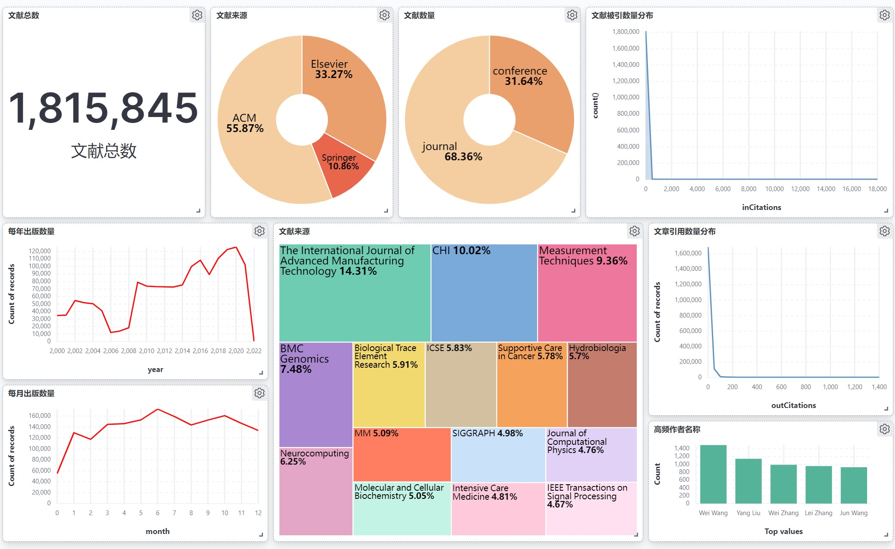

# Let's Go For NeurIPS

- [Let's Go For NeurIPS](#head1)
    - [ 项目介绍](#head2)
    - [ 小组分工](#head3)
    - [ 功能特色](#head4)
        - [ 1.爬取数据自动去重](#head5)
        - [ 2.IP池、线程池爬取](#head6)
        - [ 3.增量爬取](#head7)
        - [ 4.异常处理](#head8)
        - [ 5.断点续爬](#head9)
        - [ 6.日志技术](#head10)
    - [ 整体效果](#head11)
    - [ 执行方法](#head12)
        - [ 1.运行环境](#head13)
        - [ 2.安装依赖](#head14)
        - [ 3.安装可视化组件](#head30)
          - [ 3.1 ElasticSearch](#head31)
          - [ 3.2 MongoDB](#head32)
          - [ 3.3 Kibana](#head33)
          - [ 3.4 ProxyPool](#head34)
        - [ 4.运行](#head15)
    - [ 第三方库依赖](#head16)
    - [ 系统架构](#head17)
        - [ 1.总体架构](#head18)
        - [ 2.爬虫服务](#head19)
    - [ 各模块执行原理](#head20)
        - [ 1.ACM](#head21)
        - [ 2.Springer](#head22)
        - [ 3.ScienceDirect](#head23)
        - [ 4.IP池服务](#head24)
        - [ 5.数据库](#head25)
        - [ 6.Elasticsearch可视化展示平台](#head26)
    - [ 代码结构](#head27)
# <span id="head1"> Let's Go For NeurIPS</span>

## <span id="head2"> 项目介绍</span>

我们的工作基于[scrapy](https://scrapy.org)框架实现了一个对学术论文网站的大规模爬虫系统，包括对[ACM](https://dl.acm.org)、[Springer](https://www.springer.com)、[ScienceDirect](https://www.sciencedirect.com)三个网站的论文爬取，爬取到的信息包括论文的各项信息、pdf文件以及视频url地址等，爬取到的数据存储在[MongoDB](https://www.mongodb.com)中，并通过[Elasticsearch](https://www.elastic.co)+[Kibana](https://www.elastic.co)搭建了一个可视化检索系统，对爬取的数据建立索引进行展示。

## <span id="head3"> 小组分工</span>

| 姓名                                    | 学号       | 分工                           |
| --------------------------------------- | ---------- | ------------------------------ |
| 王昊    | 3120211034 | ACM网站爬取逻辑，Elasticsearch检索系统，工作整合与对接         |
| 刘文鼎  | 3120211080 | MongoDB数据库搭建及接口实现，数据库相关功能实现        |
| 何鹏    | 3120211035 | ScienceDirect网站爬取逻辑，IP池动态获取 |
| 王星煜  |3120211055  |   系统框架搭建，代理IP池爬取       |
| 徐天祥  |3120211026  |   Springer网站爬取逻辑       |
| 杨雪    | 3120211001 |  部分ACM网站爬取逻辑，汇报材料   |


## <span id="head4"> 功能特色</span>

#### <span id="head5"> 1、爬取数据自动去重</span>

- 当爬虫爬取到相同论文时，在存入数据库时会自动去除重复数据

#### <span id="head6"> 2、IP池、线程池爬取</span>

- 部署了一个代理IP池，爬虫爬取时从IP池中获得一个随机可用的IP，支持多线程爬取数据，增加爬虫的健壮性

#### <span id="head7">3、增量爬取</span>

- 支持增量式爬取，定时更新

#### <span id="head8">4、异常处理</span>

- 使用try-catch逻辑块进行异常处理，不再担心爬虫意外退出

#### <span id="head9"> 5、断点续爬</span>

- 出现网络崩溃或者手动终止时，可以从断点续爬

#### <span id="head10"> 6、日志技术</span>

- 爬虫的爬取信息和爬取状态会实时通过日志输出

## <span id="head11"> 整体效果</span>

- 数据库中共有记录1290137条

- 下载PDF共***篇


  **具体统计**（注：由于增量式爬取，有些论文被多个网站爬取，各网站爬取之和多于数据库记录）

  | 网站名        | 爬取数量 | 下载PDF数量 |
  | ------------- | -------- | ----------- |
  | ACM           |   1015174   |   197884       |
  | Springer      |  196789   |        |
  | ScienceDirect |  78174  |    0    |

  | 字段名          | 数量   | 覆盖率 | 
  | ------------   | ------ | ------ |
  | title          | 1290137 |  100.00% |
  | abstract       |  1217294 |  94.35%  |                                                              
  | authors        | 1290137 |  100.00%  |                                                              
  | doi            | 1069871 |  82.93% |                                                              
  | url            | 1290137 |  100.00% |  
  | year           |  1235394 |  95.76% |                                          
  | month          | 1235394 |  95.76% |                                                              
  | type           | 1290137 | 100.00%  |                                                              
  | venue          | 1290125 |  100.00% |                                                              
  | source         | 1290137 | 100.00% |                                                              
  | video_url      | 18839  |  1.46%  |                                         
  | video_path     |   18839 |  1.46%  |                                                              
  | thumbnail_url  | 18839  | 1.46% |                                                              
  | pdf_url        | 385177 | 29.86% |                                                              
  | pdf_path       | 385177  |  29.86% |                                         
  | inCitations    | 1158297   |  89.78%   |                                                              
  | outCitations   | 1241198  | 96.21% |

## <span id="head12"> 执行方法</span>

### <span id="head13"> 1.运行环境</span>

系统：Windows、Linux、MacOS

软件：python3

### <span id="head14"> 2.安装依赖</span>

```
pip install -r requirements.txt
```


### <span id="head30"> 3.安装组件</span>

#### <span id="head31"> 3.1 ElasticSearch</span>

1. 下载ElasticSearch

   ``` wget https://artifacts.elastic.co/downloads/elasticsearch/elasticsearch-7.16.2-linux-x86_64.tar.gz ```

2. 解压安装包

   ``` tar -xzf elasticsearch-7.16.2-linux-x86_64.tar.gz```

3. 运行ElasticSearch

   ``` cd elasticsearch-7.16.2/```

   ``` ./bin/elasticsearch```

4. 检查安装结果
   
   运行
   ```curl 'localhost:9200'```
    若有欢迎信息提示，则代表安装成功

#### <span id="head32">3.2 MongoDB </span>
1. 安装依赖

在Linux平台安装前需要先安装各个Linux平台依赖包，Ubuntu系统下执行：

```
sudo apt-get install libcurl4 openssl
```

2. 下载解压安装

可以从MongoDB官网下载安装包，下载地址：https://www.mongodb.com/download-center/community


选择tgz下载，并解压安装包：

```
wget https://fastdl.mongodb.org/linux/mongodb-linux-x86_64-ubuntu1804-5.0.5.tgz    # 下载
tar -zxvf mongodb-linux-x86_64-ubuntu1804-5.0.5.tgz                                # 解压
```

将解压后的文件移动到指定目录：

```
mv mongodb-src-r5.0.5  /usr/local/mongodb                         # 将解压包拷贝到指定目录
```

MongoDB 的可执行文件位于 bin 目录下，所以可以将其添加到 PATH 路径中:
```
export PATH=/usr/local/mongodb/bin:$PATH
```

3. 启动MongoDB

MongoDB启动时需要指定将数据和日志文件存储在特定的目录下，创建这两个目录：

```
sudo mkdir -p /var/lib/mongo           # 创建数据存储目录
sudo mkdir -p /var/log/mongodb         # 创建日志文件目录
sudo chown `whoami` /var/lib/mongo     # 设置权限
sudo chown `whoami` /var/log/mongodb   # 设置权限
```

由于启动时需要指定很多参数，可以用`.conf`文件的形式将启动时的参数都指定好，创建`mongodb.conf`文件，并在文件中指定以下参数：

```
# 数据文件存放目录
dbpath=/var/lib/mongo
# 日志文件存放目录
logpath=/var/log/mongodb/mongod.log
# 以追加的方式记录日志
logappend=true
# 默认端口为27017
port=27017
# 对访问IP不做限制
bind_ip=0.0.0.0
# 以守护进程方式启用
fork=true
```

启动MongoDB：
```
cd /usr/local/mongodb/
./bin/mongod -f ./bin/mongodb.conf
```

5. 测试连接

运行
```
./bin/mongo
```
如果出现欢迎信息，则说明连接成功。

#### <span id="head33">3.3 Kibana </span>

1. 下载Kibana

   ``` curl -O https://artifacts.elastic.co/downloads/kibana/kibana-7.16.2-darwin-x86_64.tar.gz ```

2. 解压安装包

   ```tar -xzf kibana-7.16.2-darwin-x86_64.tar.gz```

3. 运行ElasticSearch

   ``` cd kibana-7.16.2-darwin-x86_64/```

   ``` ./bin/kibana```
   
4. 检查安装结果
   
    访问'localhost:5601"，若看到控制台页面，则证明安装成功

#### <span id="head34">3.4 ProxyPool </span>

1. 下载ProxyPool
    ```
    git clone https://github.com/Python3WebSpider/ProxyPool.git
    cd ProxyPool
    ```

2. 安装依赖包

    ``` pip3 install -r requirements.txt ```

3. 安装和配置 Redis
    https://www.runoob.com/redis/redis-install.html
    ```
    export REDIS_HOST='localhost'
    export REDIS_PORT=6379
    export REDIS_PASSWORD=''
    export REDIS_DB=0
    ```

4. 启动 Rdies
  
    ``` ./redis-server ```

5. 运行代理池

    ``` python3 run.py```


5. 使用
    成功运行之后可以通过 http://localhost:5555/random 获取一个随机可用代理

### <span id="head15"> 4.运行</span>

- 将仓库克隆至本地

- 执行准备程序 ```python prepare.py```

- 切换路径 ```cd Reptiles```

- 更改脚本权限 ```chmod +x run.sh```

- 运行脚本 ```./run.sh ACM```
其中ACM可替换为其他爬取源，包括Springer,ScienceDirect.爬虫运行日志位于Logs文件内

## <span id="head16"> 第三方库依赖</span>
参见`./requirements.txt`
## <span id="head17"> 系统架构</span>

### <span id="head18"> 总体架构</span>


系统整体基于Scrapy爬虫框架，对Middelware层和Pipeline层进行了重写，分别完成爬取时的身份代理与下载器的配置，在此基础上针对不同网站的爬取规则实现了三种不同的Spiders。系统外围还集成了代理IP池采集模块，数据存储模块与数据可视化模块。\
**本系统可分为六大模块**：
1. Spiders(爬虫)：它负责处理所有Responses,从中分析提取数据，获取Item字段需要的数据，并将需要跟进的URL提交给引擎，再次进入Scheduler(调度器)。
2. Engine(引擎)：负责Spider、ItemPipeline、Downloader、Scheduler中间的通讯，信号、数据传递等
3. Scheduler(调度器)：它负责接受引擎发送过来的Request请求，并按照一定的方式进行整理排列，入队，当引擎需要时，交还给引擎
4. Downloader(下载器)：负责下载Scrapy Engine(引擎)发送的所有Requests请求，并将其获取到的Responses交还给Scrapy Engine(引擎)，由引擎交给Spider来处理
5. Spider Middlewares（Spider中间件）：你可以理解为是一个可以自定扩展和操作引擎和Spider中间通信的功能组件（比如进入Spider的Responses和从Spider出去的Requests）
6. Item Pipeline((管道):它负责处理 Spider中获取到的item,并进行后期处理(详细分析、过滤、存储等)
### <span id="head19"> 爬取流程</span>


系统首先输入的爬取网站，读取预定义的爬取约束信息，然后通过中间件从预先爬取的代理IP池中随机选取一个可用IP，使用代理IP下载网站页面，并对页面内容进行解析，根据解析结果提取论文相关信息，并启动下载器对PDF、视频等文件进行下载，将数据分别存储到MongoDB
与本地磁盘，然后根据预定义的遍历规则与约束条件，对其他页面进行爬取，直到所有任务完成。

## <span id="head20"> 各模块执行原理</span>

### <span id="head21"> 1、ACM</span>

#### 1.1 网站遍历逻辑

- 根据观察可知，ACM提供了"/dl.acm.org/action/doSearch"接口来提供论文信息查询服务，通过构造请求参数，可以查询到全站论文信息。
- 上述接口可供填写的请求参数有：
  - AfterYear/AfterMonth/AfterDay：查询截止年/月/日
  - BeforeYear/BeforeMonth/BeforeDay ：查询起始年/月/日
  - concept: 查询文献所属类别
  - sorted: 查询结果排序依据
  - startPage：查询结果返回的开始页码
  - pageSize：一次查询返回的结果数量
- 由于ACM接口做了防爬取处理，每次查询返回最多2000条数据，本系统按日期对全站数据进行遍历查询
  - 通过接口"/dl.acm.org/action/doSearch"查询当日出版的某一页论文数据，并通过startPage控制查询进度，解析得到某个文献的具体内容网址
  - 解析文献具体网址，从中提取基本信息、pdf链接、视频链接
  - 如果pdf或视频链接存在，则使用下载器进行下载

#### 1.2 网站解析逻辑

每个单独文献的解析如下，使用xpath进行内容提取，部分特殊处理逻辑为：

1. 引用文献数量(inCitations)：获取所有引用文献，并统计列表长度作为引用文献数量
2. 视频链接(video_url)与封面链接(thumbnail_url)：获取视频播放源地址，并使用"videodelivery.net/" + source +"/thumbnails/thumbnail.jpg?time=10.0s"作为完整地址
3. 摘要(abstract):部分文献摘要为pdf格式的图片，需做异常判断处理
4. 视频链接(pdf_url)和视频存放路径(pdf_path):若文献存在视频，则将论文题目去除标点符号并以小写形式作为视频名，保存并下载


### <span id="head22"> 2. Springer</span>

#### 2.1 网站遍历逻辑

- 根据观察可知，在<https://link.springer.com/search/page/1>即可得到Springer的全部论文
  - 但由于该页面查询最多一次现实1000页（每页20条，共20000条），故无法使用该页面进行爬取
  - 因此需要限定条件，保证每次条件限制下检索得到的论文数量小于20000条，然后对条件进行遍历实现多次检索与爬取
- 根据多次设计和实践，最终决定首先进行检索得到所有的Journal和Conference，随后对每个Journal或Conference中的论文进行爬取，这样基本保证了爬取论文数量的完整
- 此种爬取方法涉及的请求参数：
  - facet-content-type：检索分支类型，本次爬取中主要包括Journal和ConferenceProceedings
  - search-within：检索范围，本次爬取中主要包括Journal和Chapter
  - facet-journal-id：期刊编号
  - query：检索内容，由于本次爬取要求所有数据，所以本项为空
  - facet-eisbn：会议论文集电子书序号

#### 2.2 网站解析逻辑

对于每篇文献利用xpath进行内容提取，过程中部分特殊处理如下：

1. Journal中的文献和Conference中的文献页面逻辑有所不同，故两种网站的解析不同
2. 部分文献网页中可能有多个年月时间，不一定包括论文发表年份(year)和论文发表月份(month)，需要根据年月时间的种类进行判断
3. 引用论文数量(outCitations)并未直接给出，此处取文章最后一篇参考文献的编号作为引用论文数量


### <span id="head23"> 3. ScienceDirect</span>

#### 3.1 网站遍历逻辑

- 由于ScienceDirect页面使用异步加载模式，直接通过网页解析不能获取到任何论文列表，所以通过网页开发者工具截取查询请求，通过分析查询请求的构成，手动拼接查询请求获取论文列表
    - 返回结果为json格式，解析json格式获取论文列表中每个论文的链接


- 根据网页开发工具拦截可知，ScienceDirect使用了"www.sciencedirect.com/search/api?" 接口来进行论文信息查询服务，通过构造请求参数，可以查询到全站论文信息
- 上述接口可供填写的请求参数有：

  - date：查询年份

  - cid：经过爬取得到的期刊唯一id号（直接搜索期刊名称会因模糊搜索而有重复）

  - show: 每页显示的论文数量

  - offset: 查询结果偏移量

  - t：经过实时爬取的token值

- 由于ScienceDirect查询接口每次最多返回6000条数据，按日期来讲一年有远超过6000条数据，本系统按年份和期刊号的交叉对全站数据进行遍历查询

  - 通过接口"www.sciencedirect.com/search/api?" 依次构建date、cid等的字段，查询某一年某一期刊的论文列表，并通过offset控制查询进度，
  - 解析json格式，找到其中包含的论文信息，在'searchResults'键下，找到每个论文主页的链接，依次构建请求访问论文主页

#### 3.2 网站解析逻辑

- 每个单独文献的解析如下，使用xpath进行内容提取


部分特殊处理逻辑为：

- 论文标题(title)：直接在源码中meta部分获取论文标题


- 作者列表(authors)：需要分开获取given_name和surname，然后进行拼接得到每个作者的姓名


- 年份(year)与月份(month)：在论文主页scripts源码中查找发表时间，找到“Publication date”项，正则表达式分解即可得到年份和月份


- 论文类型(type)：在论文主页scripts源码中查找论文类型，找到“publicationType”项，即为论文类型


- 该论文所引用的论文数量(outCitations)：在论文主页scripts源码中查找该论文所引用的论文数量，找到“document-references”项，即为该论文所引用的论文数量


- 该论文被引用的数量(inCitations)：网页使用异步加载格式，直接提取不到该论文被引用的数量，通过网页开发者工具截取请求，分析请求格式，手动构建请求，返回json中得到“hitCount”，即为该论文被引用的数量


### <span id="head24"> 4. IP池服务</span>
- 对于ACM、Springer、ScienceDirect网站的反爬限制，采用动态代理IP的方式，使用开源GitHub项目ProxyPool https://github.com/Python3WebSpider/ProxyPool
- 从众多代理源网站爬取IP，存放在redis数据库中，并实时更新，定期从redis数据库中取出新的IP，使用这些IP来访问网站。
- 新建ProxiesMiddleware中间件，用于更新强求的代理。


  ```
    class ProxiesMiddleware(object):
      def __init__(self, settings):
          super(ProxiesMiddleware, self).__init__()
          self.step = 0
          self.proxypool_url = 'http://127.0.0.1:5555/random'
          self.proxy = self.get_random_proxy()

      @classmethod
      def from_crawler(cls, crawler):
          return cls(crawler.settings)

      def get_random_proxy(self):
          proxy = requests.get(self.proxypool_url).text.strip()
          logging.info('---get_random_proxy--- ' + str(proxy))
          return proxy

      def process_request(self, request, spider):
          self.step += 1
          if self.step % 1000 == 0:
              self.proxy = self.get_random_proxy()
          request.meta['proxy'] = 'http://' + self.proxy
          request.headers["Connection"] = "close"
  ```

### <span id="head25"> 5. 数据库</span>
MongoDB是一个基于分布式文件系统的开源数据库系统，数据存储为一个文档，数据结构由键值对组成。文档类似于json对象，字段值可以包含其他文档，数据及文档数组。  
#### 5.1 执行流程
对爬取到的每一篇论文根据论文标题计算一个`checksum`值，根据`checksum`判断论文是否已经在数据库中了，如果已在数据库中则对已有数据进行更新，否则执行插入操作。
#### 5.2 checksum计算规则
使用正则表达式：
```python
checksum = re.sub(r'[\W\d\_]', "", info['title']).lower()
```
`checksum`即去除论文标题中除了字母和数字以外的所有字符，并将字母全部取小写。
#### 5.3 接口定义
采用`python`中的第三方库`pymongo`与数据库进行交互。  
具体代码参见`./Reptiles/Reptiles/data_manager.py`。  
- 连接数据库：
```python
Mongo = MongoManager()
```
- 插入及更新数据：
```python
Mongo.mongodb_insert(site, info)
```
- 删除数据：
```python
Mongo.mongodb_delete(site, field, value)
```
- 查询数据：
```python
Mongo.mongodb_find(site, field, value)
```
### <span id="head26"> 6.Elasticsearch可视化展示平台</span>

1. 执行流程

   将安装好的elasticsearch与Kibana程序在指定端口启动，爬虫爬取到的item会经过流水线先在mongodb数据库中进行查询，若记录未存在，则通过api插入至Elasticsearch系统中，实现数据的动态增量更新。

2. 数据可视化

    访问Elasticsearch控制台localhost:5601，并在dashboard中找到数据，可根据提供api自定义可视化控件。


## <span id="head27"> 代码结构</span>
- 代码结构
```
│  README.md
│  requirements.txt
│
└─Reptiles
    │  scrapy.cfg
    │  start.bat
    │  run.sh //启动脚本
    └─Reptiles
        │  convert_json.py
        │  items.py //数据结构定义
        │  middlewares.py //动态切换ip代理
        │  data_manager.py  // 数据交互逻辑
        │  pipelines.py // PDF与视频下载流水线
        │  proxy.py //ip池爬取
        │  settings.py //爬虫配置文件，包括日志，文件下载路径等
        │  __init__.py
        │
        ├─configs
        │      proxylist_big.txt //代理ip存放文件
        │
        └─spiders
                ACM.py // ACM网站解析逻辑
                ScienceDirect.py //ScienceDirect网站解析逻辑
                Springer.py //Springer网站解析逻辑
                __init__.py
```

